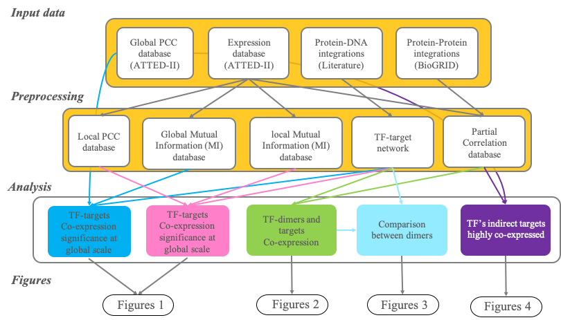

# Co-expression-Signature-of-Combinatorial-Gene-Regulation (CSCGR)
This repository contain description of primary data, processed data, and codes used to optain the main results of this project 

**This is the pipeline/summary of the analysis that were done in this work. Description of input data, intermedia files, and scripts are describe on the corresping directories**

 

